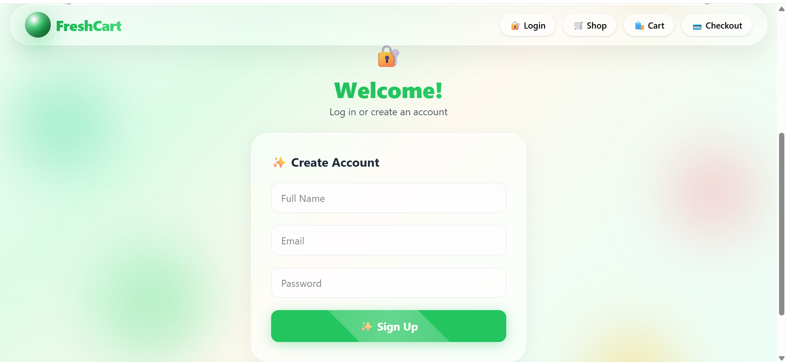
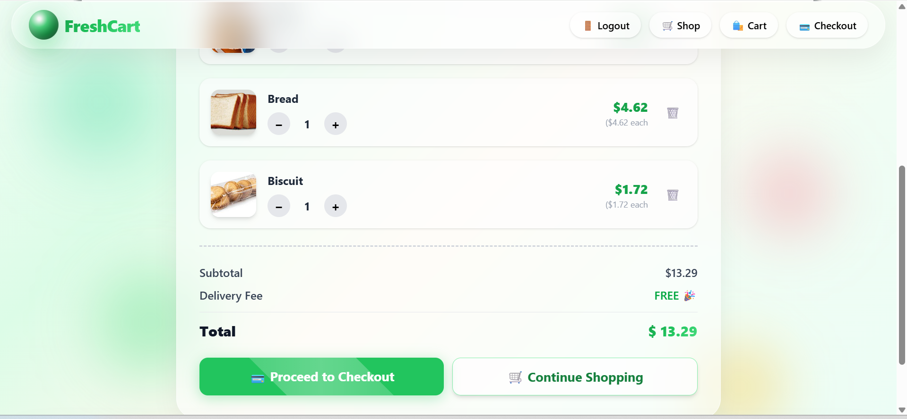
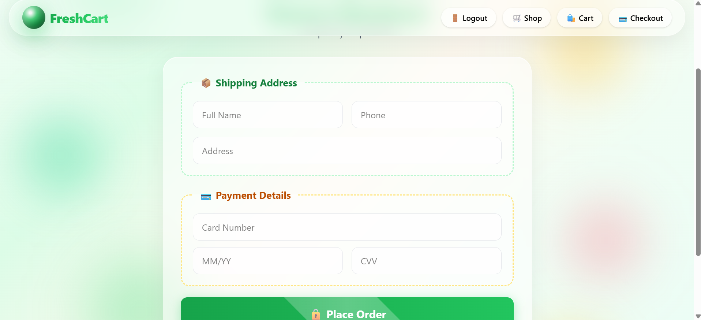
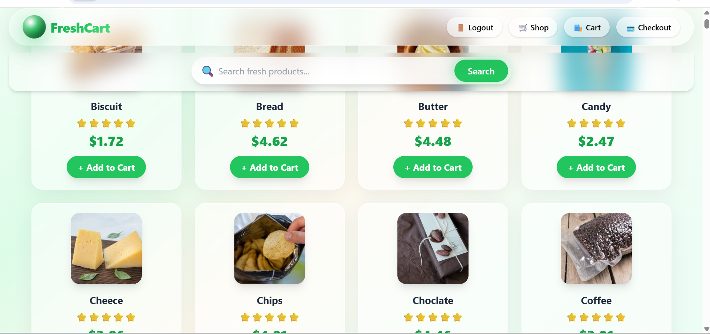

# FreshCart – Premium Grocery Store

A responsive grocery store UI built with HTML, Tailwind CSS and vanilla JavaScript.

## Features

- User login / signup (localStorage)
- Dynamic product listing with images
- Search bar to filter products
- Add to cart, remove, quantity +/-
- Checkout with shipping & payment form
- Order success confirmation with animation
- Login‑required popup for protected pages
- Fully responsive (mobile, tablet, desktop)
- 3D card effects and glass‑morphism design

## Tech Stack

- HTML5
- Tailwind CSS (v4, CLI)
- JavaScript (ES6)
- LocalStorage

